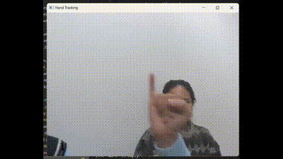

[](https://classroom.github.com/a/aYb0mV4s)

# Project Title: ASL Recognition Using Computer Vision & Translation:

## Description

This application is an innovative solution that tries to leverage computer vision and translation technologies to bridge communication gaps between individuals using American Sign Language (ASL) and those who may not be proficient in sign language. This application provides real-time recognition of ASL alphabets captured through a device's camera, translating them into text for a seamless and inclusive communication experience.

## Key Features:

- Real Time ASL Recognition
- Translation to Text
- User Friendly Interface

## How to Use:

- Git Clone this repository to your local device
- Install these libraries if you don't already have them installed:
  - Mediapipe
  - TensorFlow
  - Numpy
  - Opencv

```bash
pip install mediapipe
pip install tensorflow as tf
pip install numpy as np
pip install opencv 
```

- Launch the Application on your local device using your preferred IDE.
- If you don't have a working camera on your local device, make sure to connect an external one.
- Allow the application to access your device's camera.
- Run the run.py to launch the interative application and use it!

## Demo:



## Reference:

[Gesture Recognition by aqua1907](https://github.com/aqua1907/Gesture-Recognition/tree/master) for the dataset
